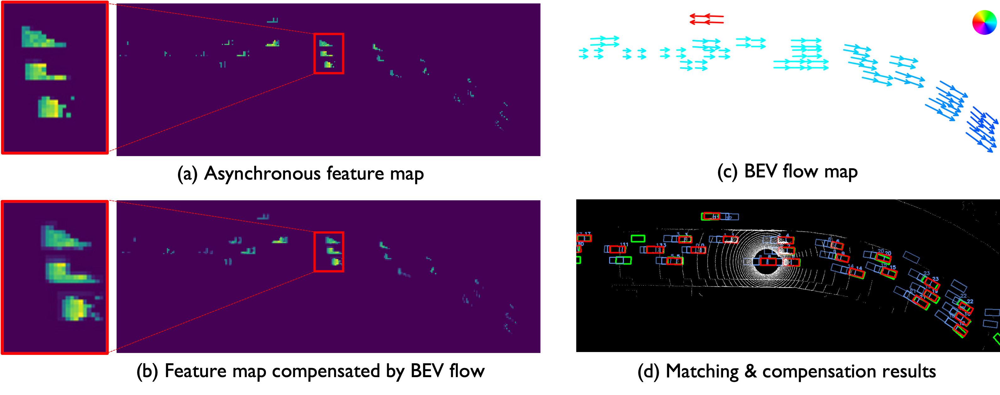
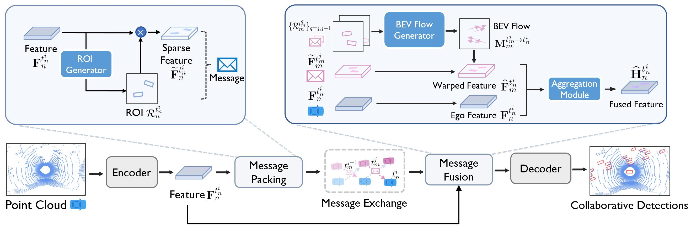

# <div align="center">CoBEVFlow (NeurIPS 2023)</div>
This repository contains the official PyTorch implementation of NeurIPS 2023 paper "[Asynchrony-Robust Collaborative Perception via Bird’s Eye View Flow](https://arxiv.org/abs/2309.16940)". 
[Sizhe Wei](https://sizhewei.github.io/), [Yuxi Wei](https://www.linkedin.cn/incareer/in/ACoAADSxRKcB7zJIIKFvPU9bvO1G2BT7Mx6S4vw), [Yue Hu](https://phyllish.github.io), [Yifan Lu](https://yifanlu0227.github.io/), [Yiqi Zhong](https://scholar.google.com/citations?user=Bv8l8jkAAAAJ&hl=en&authuser=1), [Siheng Chen](http://siheng-chen.github.io/), [Ya Zhang](https://mediabrain.sjtu.edu.cn/yazhang/).

[](https://paperswithcode.com/sota/3d-object-detection-on-irv2v?p=robust-asynchronous-collaborative-3d)
[](https://paperswithcode.com/sota/3d-object-detection-on-dair-v2x?p=robust-asynchronous-collaborative-3d)

[](https://opensource.org/licenses/MIT) 
[](https://arxiv.org/abs/2309.16940)
[](https://sizhewei.github.io/projects/cobevflow/)

<div align="center">
  <table style="width:800px">
    <tr>
      <td align="center" style="width:400px">
        <p style="font-size: 90%; color: #999999">Asynchronous Co-Perception</p>
        <p></p>
        <p></p>
        <p></p>
      </td>
      <td align="center" style="width:400px">
        <p style="font-size: 90%; color: #999999">With CoBEVFlow</p>
        <p></p>
        <p></p>
        <p></p>
      </td>
    </tr>
  </table>
</div>



## Main Idea
### Abstract
Collaborative perception can substantially boost each agent's perception ability by facilitating communication among multiple agents. However, temporal asynchrony among agents is inevitable in the real world due to communication delays, interruptions, and clock misalignments. This issue causes information mismatch during multi-agent fusion, seriously shaking the foundation of collaboration. To address this issue, we propose CoBEVFlow, an asynchrony-robust collaborative perception system based on bird's eye view (BEV) flow. The key intuition of CoBEVFlow is to compensate motions to align asynchronous collaboration messages sent by multiple agents. To model the motion in a scene, we propose BEV flow, which is a collection of the motion vector corresponding to each spatial location. Based on BEV flow, asynchronous perceptual features can be reassigned to appropriate positions, mitigating the impact of asynchrony. CoBEVFlow has two advantages: (i) CoBEVFlow can handle asynchronous collaboration messages sent at irregular, continuous time stamps without discretization; and (ii) with BEV flow, CoBEVFlow only transports the original perceptual features, instead of generating new perceptual features, avoiding additional noises. To validate CoBEVFlow's efficacy, we create IRregular V2V(IRV2V), the first synthetic collaborative perception dataset with various temporal asynchronies that simulate different real-world scenarios. Extensive experiments conducted on both IRV2V and the real-world dataset DAIR-V2X show that CoBEVFlow consistently outperforms other baselines and is robust in extremely asynchronous settings.

### Architecture
The problem of asynchrony results in the misplacements of moving objects in the collaboration messages. That is, the collaboration messages from multiple agents would record various positions for the same moving object. The proposed CoBEVFlow addresses this issue with two key ideas: i) we use a BEV flow map to capture the motion in a scene, enabling motion-guided reassigning asynchronous perceptual features to appropriate positions; and ii) we generate the region of interest(ROI) to make sure that the reassignment only happens to the areas that potentially contain objects. By following these two ideas, we eliminate direct modification of the features and keep the background feature unaltered, effectively avoiding unnecessary noise in the learned features. Figure 1 is the overview of the CoBEVFlow. More tech details can be found in our paper. 



## Quick Started
### 1. Installation
Please follow the steps in [INSTALL.md](./docs/INSTALL.md) for environment preparation. 

### 2. Dataset Download
#### DAIR-V2X
Download complemented annotation from [Yifan Lu](https://github.com/yifanlu0227/CoAlign).

#### IRV2V
Coming Soon!

### 3. Train your model
#### a. Train Part 1 (Encoder, Decoder, and ROI Generator) :
```bash
CUDA_VISIBLE_DEVICES=1 python opencood/tools/train.py --hypes_yaml opencood/hypes_yaml/opv2v/npj/opv2v_irr_past_where2comm_max_multiscale_resnet.yaml 
```
Follow [OpenCOOD](https://github.com/DerrickXuNu/OpenCOOD), CoBEVFlow uses yaml file to configure all the parameters for training. To train your own model
from scratch or a continued checkpoint, run the following commonds:
```python
python opencood/tools/train.py --hypes_yaml ${CONFIG_FILE} [--model_dir  ${CHECKPOINT_FOLDER}]
```
Arguments Explanation:
- `hypes_yaml`: the path of the training configuration file, e.g. `opencood/hypes_yaml/second_early_fusion.yaml`, meaning you want to train
an early fusion model which utilizes SECOND as the backbone. See [Tutorial 1: Config System](https://opencood.readthedocs.io/en/latest/md_files/config_tutorial.html) to learn more about the rules of the yaml files.
- `model_dir` (optional) : the path of the checkpoints. This is used to fine-tune the trained models. When the `model_dir` is
given, the trainer will discard the `hypes_yaml` and load the `config.yaml` in the checkpoint folder.

#### b. Train Part 2 ( BEV Flow Generator ) :
Use file `opencood/tools/fornewdataset.py` to extract the asynchronous ROI center as the flow generator training data.

Use file `opencood/tools/traj_prediction.py` to train the 'prediction model'.

### 4. Test the model
Before you run the following command, first make sure the `validation_dir` in config.yaml under your checkpoint folder
refers to the testing dataset path, e.g. `opv2v_data_dumping/test`.

```bash
CUDA_VISIBLE_DEVICES=0 python opencood/tools/inference_irregular.py --model_dir ${CHECKPOINT_FOLDER} --fusion_method ${FUSION_STRATEGY} --save_vis_interval 400 --two_stage 1 --p 0.3 --note ${MEMO}
```
Arguments Explanation:
- `model_dir`: the path to your saved model.
- `fusion_method`: indicate the fusion strategy, currently support 'early', 'late', and 'intermediate'.
- `save_vis_interval`: interval of saving visualization result, default 5
- `two_stage`: whether use compensation methods, if you are testing CoBEVFlow or SyncNet, set this variable to 1. Otherwise, set it to 0.
- `p`: expectation of frames of time delay is caculated by Nxp. N is 10 by default, that means, if p=0.3, the expectation of delayed frames is 3.
- `note`: Memo of different experiment setting, like pose error and so on.

The evaluation results  will be dumped in the model directory.

## Features
- Dataset Support
  - [x] IRV2V
  - [x] [OPV2V](https://mobility-lab.seas.ucla.edu/opv2v/)
  - [x] [DAIR-V2X](https://github.com/AIR-THU/DAIR-V2X)
  - [x] [V2X-Set](https://github.com/DerrickXuNu/v2x-vit)

- SOTA collaborative perception method support
    - [x] [Where2comm [Neurips2022]](https://arxiv.org/abs/2209.12836)
    - [x] [V2X-ViT [ECCV2022]](https://arxiv.org/abs/2203.10638)
    - [x] [SyncNet [ECCV2022]](https://arxiv.org/abs/2207.08560)
    - [x] [DiscoNet [NeurIPS2021]](https://arxiv.org/abs/2111.00643)
    - [x] [V2VNet [ECCV2020]](https://arxiv.org/abs/2008.07519)
    - [x] Late Fusion
    - [x] Early Fusion

- Visualization
  - [x] BEV visualization
  - [x] 3D visualization

## Citation
If you are using CoBEVFlow, or IRV2V dataset for your research, please cite the following paper:
```
@inproceedings{wei2023asynchronyrobust,
      title={Asynchrony-Robust Collaborative Perception via Bird's Eye View Flow}, 
      author={Sizhe Wei and Yuxi Wei and Yue Hu and Yifan Lu and Yiqi Zhong and Siheng Chen and Ya Zhang},
      booktitle = {Advances in Neural Information Processing Systems},
      year={2023}
}
```


## Acknowledgement
Many thanks to these excellent open source projects:
- [OpenCOOD](https://github.com/DerrickXuNu/OpenCOOD)
- [Where2comm](https://github.com/MediaBrain-SJTU/Where2comm)
- [CoAlign](https://github.com/yifanlu0227/CoAlign)
